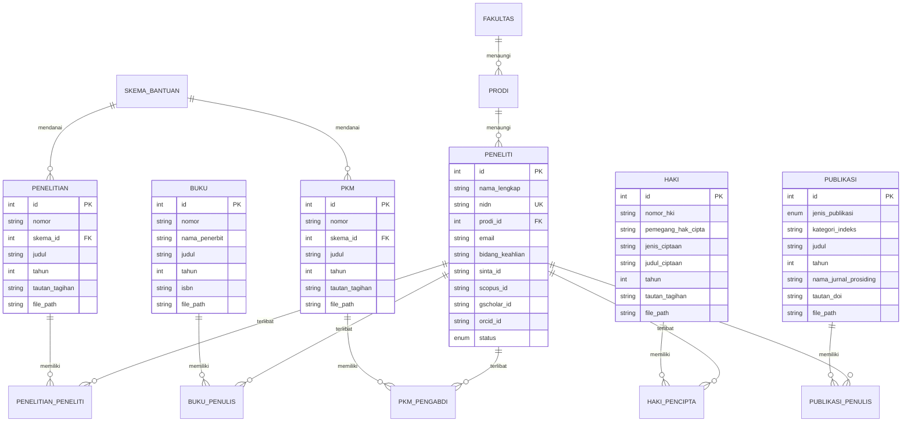
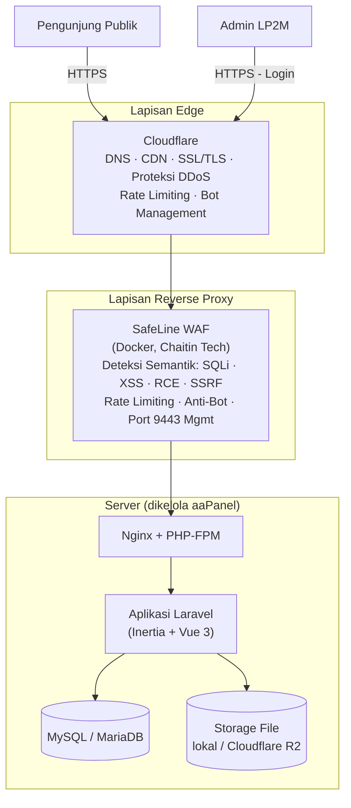

# PRD — APIK
## Akselerasi Penelitian, Inovasi, dan Kolaborasi

> **Catatan:** Dokumen ini disusun berdasarkan kebutuhan fitur yang diberikan, dibandingkan dengan pola sistem sejenis yang sudah berjalan (Direktori Riset, Publikasi, dan PKM — LP2M UIN Alauddin Makassar, di `sitasya.uin-alauddin.ac.id`) sebagai benchmark struktur data & UX, ditambah riset regulasi (Hak Cipta) dan standar klasifikasi publikasi ilmiah (SINTA) yang berlaku di Indonesia.

| | |
|---|---|
| **Versi** | 1.0 (Draft) |
| **Tanggal** | 25 Agustus 2026 |
| **Status** | Draft — menunggu validasi stakeholder (LP2M/Unit Riset) |
| **Disusun untuk** | Pengembangan sistem baru / migrasi dari proses manual |
| **Target pembaca** | Product owner, tim pengembang (backend/frontend), admin LP2M |

---

## 1. Ringkasan Eksekutif

Institusi memerlukan sistem informasi terpusat untuk mendata, menampilkan, dan mempublikasikan seluruh output riset dan karya ilmiah sivitas akademika — mencakup **Penelitian, Buku, PKM (Pengabdian kepada Masyarakat), HKI/Paten, dan Publikasi (Jurnal & Prosiding)** — yang saat ini kemungkinan tersebar di spreadsheet, laporan manual, atau tidak terdokumentasi secara publik.

Sistem ini akan berfungsi ganda:
1. **Sistem input/administrasi** (internal) — bagi admin/operator LP2M untuk mencatat setiap output riset beserta bukti dokumennya.
2. **Direktori publik** (eksternal) — etalase yang dapat dijelajahi siapa saja untuk melihat rekam jejak riset institusi, per peneliti, per tahun, per kategori — sekaligus menjadi bukti akuntabilitas dan indikator kinerja institusi (relevan untuk pemeringkatan seperti Klasterisasi Kemenristek, SINTA, dan Webometrics).

### Masalah yang Diselesaikan
- Data riset/publikasi/PKM/HKI tersebar, tidak terpusat, sulit direkap untuk laporan kinerja institusi maupun individu dosen.
- Tidak ada tautan yang jelas antara peneliti dan seluruh karyanya (one source of truth).
- Proses verifikasi dokumen pendukung (bukti tagihan, file karya) dilakukan manual.
- Tidak ada dashboard/statistik real-time untuk pimpinan (Rektorat/LP2M) memantau produktivitas riset.

---

## 2. Tujuan & Non-Tujuan

### 2.1 Tujuan (Goals)
| # | Tujuan | Indikator Keberhasilan |
|---|---|---|
| G1 | Satu basis data terpusat untuk 5 jenis output ilmiah | 100% data baru tercatat lewat sistem, bukan spreadsheet manual |
| G2 | Direktori publik yang dapat dijelajahi & diverifikasi siapa saja | Halaman direktori & profil peneliti dapat diakses tanpa login |
| G3 | Mengurangi waktu admin merekap laporan kinerja riset | Waktu rekap laporan tahunan turun signifikan (dari hari → menit, via fitur ekspor & statistik) |
| G4 | Transparansi bukti pendanaan/dokumen tiap output | Setiap entri dengan tautan/file memiliki bukti yang bisa diverifikasi (tautan aktif, file terunduh) |
| G5 | Sistem tangguh & aman berjalan di atas infrastruktur existing (aaPanel + SafeLine WAF + Cloudflare) | Tidak ada insiden keamanan kritikal pasca-launch; uptime ≥ 99.5% |

### 2.2 Non-Tujuan (Out of Scope v1)
| # | Non-Tujuan | Alasan |
|---|---|---|
| NG1 | Sinkronisasi otomatis dua-arah dengan SINTA/Scopus/Google Scholar API | Kompleksitas integrasi tinggi & bergantung ketersediaan API pihak ketiga — dijadikan kandidat fase berikutnya |
| NG2 | Alur approval/workflow berjenjang (dosen input → prodi verifikasi → LP2M approve) | Perlu pemetaan proses bisnis institusi lebih dulu; v1 asumsikan admin LP2M sebagai single entry point |
| NG3 | Portal self-service penuh bagi dosen (submit mandiri) | v1 fokus pada admin-managed data entry; self-service dapat ditambahkan fase 2 |
| NG4 | Sistem pembayaran/pencairan dana riset | Di luar ranah direktori; cukup menyimpan tautan/bukti dokumen tagihan |
| NG5 | Aplikasi mobile native | Cukup responsive web di v1 |

---

## 3. Target Pengguna

Sistem hanya memiliki 2 kategori pengguna:

| Peran | Deskripsi | Akses Utama |
|---|---|---|
| **Admin** | Pengelola sistem / operator LP2M (internal) | Login diperlukan. Full akses: CRUD semua modul (5 output riset), kelola master data (peneliti, prodi, skema bantuan), ekspor data, dan monitoring audit log |
| **Pengunjung** | Publik umum (dosen, mahasiswa, pimpinan, mitra, asesor, masyarakat) | Tanpa login. Jelajahi direktori publik, pencarian & filter karya, lihat profil peneliti, statistik/dashboard publik, buka tautan sumber, unduh file dokumen |

### Matriks Hak Akses

| Aksi / Fitur | Admin (Internal) | Pengunjung (Publik) |
|---|:---:|:---:|
| Login ke Panel Pengelolaan | ✅ | ❌ |
| Tambah / Ubah / Hapus Data (5 Modul Output) | ✅ | ❌ |
| Kelola Master Data (Peneliti, Prodi, Skema) | ✅ | ❌ |
| Ekspor Data Rekap (Excel/PDF) | ✅ | ❌ |
| Lihat Log Aktivitas (Audit Trail) | ✅ | ❌ |
| Akses Direktori Publik & Pencarian/Filter | ✅ | ✅ |
| Buka Halaman Profil Peneliti & Detail Karya | ✅ | ✅ |
| Unduh File Dokumen / Buka Tautan Sumber | ✅ | ✅ |
| Lihat Dashboard & Visualisasi Statistik Publik | ✅ | ✅ |

---

## 4. User Stories

**Admin (Pengelola)**
- Sebagai admin, saya ingin menginput data output ilmiah baru (Penelitian, Buku, PKM, HKI, Publikasi) dengan memilih peneliti dari database master agar data konsisten dan bebas saltik.
- Sebagai admin, saya ingin mengunggah file dokumen pendukung (PDF) dan/atau menautkan link tagihan/sumber agar setiap entri memiliki bukti validasi.
- Sebagai admin, saya ingin mengelola master data peneliti, program studi, dan skema bantuan agar referensi data selalu mutakhir.
- Sebagai admin, saya ingin melihat audit log perubahan data agar mengetahui jejak aktivitas pengelolaan.
- Sebagai admin, saya ingin mengekspor data rekap ke Excel/PDF untuk kebutuhan pelaporan kinerja riset.

**Pengunjung (Publik)**
- Sebagai pengunjung, saya ingin mencari dan memfilter karya ilmiah berdasarkan jenis, tahun, dan tingkat indeks (SINTA/Scopus) dengan cepat tanpa perlu login.
- Sebagai pengunjung, saya ingin membuka profil peneliti dan melihat seluruh rekam jejak karyanya (Penelitian, Buku, PKM, HKI, Publikasi) dalam satu halaman utuh.
- Sebagai pengunjung, saya ingin mengklik tautan sumber atau mengunduh dokumen secara langsung dari daftar karya.
- Sebagai pengunjung (termasuk pimpinan/asesor), saya ingin melihat dashboard statistik dan tren produktivitas riset institusi secara transparan.

---

## 5. Model Data

### 5.1 Prinsip Desain
- **Peneliti adalah master data tunggal** — direferensikan (bukan diketik ulang) oleh 4 dari 5 modul output. Ini mencegah duplikasi nama seperti yang ditemukan pada sistem acuan (mis. nama yang sama tercatat berulang kali dengan NIDN berbeda karena tidak ada dedup). **Rekomendasi:** terapkan constraint unik pada NIDN, dan bila satu orang punya afiliasi ke >1 program studi, modelkan sebagai relasi banyak-ke-banyak (bukan duplikasi baris Peneliti).
- Relasi **Peneliti ↔ setiap output** bersifat **many-to-many** (satu penelitian bisa multi-peneliti; satu peneliti bisa punya banyak penelitian) — sesuai permintaan "bisa lebih dari 1".
- Field **"Nama"** pada modul Penelitian/Buku/PKM diasumsikan sebagai **nama skema/program bantuan** (mis. "Bantuan Penelitian Dasar Pembinaan/Kapasitas"), bukan duplikat judul — lihat catatan di §14.
- Field **"Tagihan (tautan)"** diasumsikan sebagai tautan ke dokumen bukti pencairan/klaim dana bantuan — lihat catatan di §14.

### 5.2 Diagram Entitas-Relasi

### 5.3 Kamus Data Ringkas (tabel referensi/lookup)

| Tabel Referensi | Isi | Sumber |
|---|---|---|
| `fakultas` | Daftar fakultas (mis. 9 fakultas) | Data akademik institusi |
| `prodi` | Daftar program studi, terhubung ke fakultas | Data akademik institusi |
| `skema_bantuan` | Nama-nama skema hibah/bantuan penelitian & PKM internal (dikelola admin, bukan teks bebas) | Diusulkan sebagai peningkatan kualitas data |
| `jenis_ciptaan` | 19 kategori ciptaan menurut UU 28/2014 Pasal 40 ayat (1) | Lihat §7.5 |
| `kategori_publikasi` | Klasifikasi Jurnal/Prosiding & tingkat indeksasinya | Lihat §7.6, mengacu skema SINTA/ARJUNA |

---

## 6. Kebutuhan Fungsional — Ringkasan Modul

| Modul | Prioritas | Deskripsi Singkat |
|---|:---:|---|
| Master Data Peneliti | P0 | Basis data peneliti, direferensikan modul lain |
| Modul Penelitian | P0 | CRUD data riset |
| Modul Buku | P0 | CRUD data buku |
| Modul PKM | P0 | CRUD data pengabdian masyarakat |
| Modul HKI/Paten | P0 | CRUD data kekayaan intelektual |
| Modul Publikasi | P0 | CRUD data jurnal & prosiding |
| Direktori Publik | P0 | Pencarian, filter, tampilan publik lintas modul |
| Dashboard | P0 | Ringkasan angka & grafik utama |
| Statistik | P1 | Analitik lebih dalam (tren, distribusi, top list) |
| Manajemen Pengguna Admin | P0 | Autentikasi & manajemen akun admin |
| Log Aktivitas (Audit Trail) | P1 | Jejak perubahan data oleh admin |
| Ekspor Data | P1 | Rekap Excel/CSV/PDF |
| Kolaborasi Peneliti per Negara | P2 | Visualisasi peta kolaborasi internasional |
| Integrasi API SINTA/Scopus | P2 | Sinkronisasi otomatis data eksternal (fase mendatang) |

---

## 7. Detail Kebutuhan Fungsional per Modul

### 7.1 Master Data Peneliti (P0)

**Field:**

| Field | Tipe | Wajib | Keterangan |
|---|---|:---:|---|
| Nama Lengkap | Teks | ✓ | termasuk gelar akademik bila ada |
| NIDN/NIP | Teks, unik | ✓ | validasi format, tapi tetap terima variasi legacy |
| Program Studi | Dropdown (dari master Prodi) | ✓ | menentukan Fakultas otomatis |
| Foto Profil | Upload gambar (jpg/png, maks 2MB) | – | |
| Email | Teks (validasi email) | – | |
| No. HP/WA | Teks | – | |
| Bidang Keahlian | Tag/multi-teks | – | ditampilkan di profil publik |
| SINTA ID / Scopus ID / Google Scholar ID / ORCID | Teks | – | untuk tautan otomatis ke profil eksternal |
| Status | Aktif / Tidak Aktif / Purna Tugas | ✓ | default: Aktif |

**Acceptance Criteria:**
- [ ] Admin dapat menambah, mengedit, menonaktifkan peneliti.
- [ ] NIDN bersifat unik di sistem — mencegah duplikasi record.
- [ ] Field ini digunakan sebagai sumber pilihan (searchable multi-select) di 4 modul output lain.
- [ ] Jika peneliti belum ada di database saat input output ilmiah, admin bisa menambah cepat ("+ Tambah Peneliti Baru") tanpa keluar dari form yang sedang diisi.

---

### 7.2 Modul Penelitian (P0)

| Field | Tipe | Wajib | Keterangan |
|---|---|:---:|---|
| Nomor | Teks/auto-generate | ✓ | nomor registrasi/SK penugasan |
| Nama | Dropdown (master Skema Bantuan) | ✓ | *lihat asumsi §14 — nama skema/program, mis. "Bantuan Penelitian Dasar Pembinaan/Kapasitas"* |
| Judul Penelitian | Teks panjang | ✓ | |
| Peneliti | Multi-select (cari dari database Peneliti) | ✓ | minimal 1 |
| Tahun | Angka (4 digit) | ✓ | |
| Tagihan (tautan) | URL | – | tautan bukti pencairan/klaim dana |
| Upload | File (PDF, maks 10MB) | – (opsional) | laporan hasil penelitian |

**Acceptance Criteria:**
- [ ] Satu penelitian dapat memiliki lebih dari satu peneliti (many-to-many).
- [ ] Jika "Tagihan" diisi, tombol "Buka tautan" muncul di tampilan publik dan membuka di tab baru.
- [ ] Jika "Upload" diisi, tombol "Unduh" muncul; jika kosong, tombol tersembunyi (bukan error).
- [ ] Validasi: tautan harus format URL valid (http/https).

---

### 7.3 Modul Buku (P0)

| Field | Tipe | Wajib | Keterangan |
|---|---|:---:|---|
| Nomor | Teks/auto-generate | ✓ | |
| Nama | Teks | ✓ | *asumsi: nama penerbit — lihat §14* |
| Judul Buku | Teks panjang | ✓ | |
| Penulis | Multi-select (dari database Peneliti) | ✓ | minimal 1 |
| Tahun | Angka (4 digit) | ✓ | |
| ISBN | Teks | – | direkomendasikan ditambahkan meski tidak diminta eksplisit, standar bibliografi buku |
| Upload | File (PDF, maks 20MB) | – (opsional) | |

**Catatan:** Buku tidak memiliki field "Tagihan" sesuai spesifikasi awal — konsisten dengan temuan pada sistem acuan (Buku umumnya tidak melalui skema hibah dengan pencairan bertahap seperti Penelitian/PKM).

---

### 7.4 Modul PKM — Pengabdian kepada Masyarakat (P0)

| Field | Tipe | Wajib | Keterangan |
|---|---|:---:|---|
| Nomor | Teks/auto-generate | ✓ | |
| Nama | Dropdown (master Skema Bantuan) | ✓ | nama skema PKM |
| Judul PKM | Teks panjang | ✓ | |
| Pengabdi | Multi-select (dari database Peneliti) | ✓ | minimal 1 |
| Tahun | Angka (4 digit) | ✓ | |
| Tagihan (tautan) | URL | – | |
| Upload | File (PDF, maks 10MB) | – (opsional) | |

---

### 7.5 Modul HKI/Paten (P0)

| Field | Tipe | Wajib | Keterangan |
|---|---|:---:|---|
| Nomor HKI | Teks | ✓ | nomor sertifikat/pencatatan DJKI |
| Pencipta | Multi-select (dari database Peneliti) | ✓ | *direkomendasikan direferensikan ke Peneliti — sama seperti modul lain, agar profil peneliti otomatis menampilkan karya HKI-nya* |
| Pemegang Hak Cipta | Teks bebas **atau** pilih dari Peneliti/institusi | – | secara hukum, pemegang hak bisa berbeda dari pencipta (mis. institusi) — lihat catatan di bawah |
| Jenis Ciptaan | Dropdown (19 kategori resmi) | ✓ | lihat tabel referensi di bawah |
| Judul Ciptaan | Teks panjang | ✓ | |
| Tahun | Angka (4 digit) | ✓ | |
| Tagihan (tautan) | URL | – | |
| Upload | File (PDF, maks 10MB) | – (opsional) | sertifikat pencatatan |

**Catatan hukum penting — Pencipta vs. Pemegang Hak Cipta:**
Menurut UU No. 28 Tahun 2014, **Pencipta** adalah individu yang menghasilkan karya, sedangkan **Pemegang Hak Cipta** adalah pihak yang memegang hak ekonominya — bisa sama dengan Pencipta, atau berbeda (misalnya institusi, jika karya dihasilkan dalam hubungan kerja/dinas). Karena itu, field "Pemegang Hak Cipta" dirancang fleksibel: bisa memilih dari Peneliti, atau mengetik nama institusi/pihak lain.

**Referensi — Daftar "Jenis Ciptaan" (UU No. 28 Tahun 2014, Pasal 40 ayat 1):**

| # | Jenis Ciptaan |
|---|---|
| 1 | Buku, pamflet, dan semua hasil karya tulis lainnya |
| 2 | Ceramah, kuliah, pidato, dan ciptaan sejenis |
| 3 | Alat peraga untuk pendidikan dan ilmu pengetahuan |
| 4 | Lagu dan/atau musik dengan atau tanpa teks |
| 5 | Drama, drama musikal, tari, koreografi, pewayangan, pantomim |
| 6 | Karya seni rupa (lukisan, gambar, ukiran, kaligrafi, seni pahat, patung, kolase) |
| 7 | Karya seni terapan |
| 8 | Karya arsitektur |
| 9 | Peta |
| 10 | Karya seni batik atau seni motif lain |
| 11 | Karya fotografi |
| 12 | Potret |
| 13 | Karya sinematografi |
| 14 | Terjemahan, tafsir, saduran, bunga rampai, basis data, aransemen, modifikasi, dan karya hasil transformasi lain |
| 15 | Terjemahan, adaptasi, aransemen, transformasi/modifikasi ekspresi budaya tradisional |
| 16 | Kompilasi ciptaan atau data (dalam format yang dapat dibaca program komputer maupun media lain) |
| 17 | Kompilasi ekspresi budaya tradisional (selama merupakan karya asli) |
| 18 | Permainan video |
| 19 | **Program komputer** |

> Untuk konteks akademik seperti PKM/riset kampus, kategori yang paling sering dipakai umumnya adalah **#1 (karya tulis/buku ajar), #16 (basis data), #18/19 (aplikasi & program komputer)**, dan **#6 (karya seni)**. Sistem cukup menyimpan ini sebagai tabel referensi yang bisa ditambah admin, karena daftar ini juga menjadi acuan formulir e-Hak Cipta DJKI — memudahkan jika suatu saat perlu sinkron istilah dengan sistem DJKI.

> **Catatan cakupan Paten:** Modul ini digabung sebagai "HKI/Paten" mengikuti permintaan awal. Perlu diketahui **Paten** (untuk invensi/teknologi) secara hukum berbeda rezim dari **Hak Cipta** (untuk karya tulis/seni/software) — Paten diklasifikasikan berdasarkan bidang teknologi (IPC) dan jenis (Paten / Paten Sederhana), bukan "Jenis Ciptaan". **Rekomendasi:** tambahkan field awal **"Jenis KI"** (Hak Cipta / Paten / Merek / Desain Industri) sebelum field "Jenis Ciptaan", sehingga field Jenis Ciptaan hanya muncul jika Jenis KI = Hak Cipta, dan field khusus Paten (Bidang Teknologi, Jenis Paten) muncul jika Jenis KI = Paten. Ini dicatat sebagai **rekomendasi**, bukan kebutuhan wajib v1, karena tidak eksplisit diminta.

---

### 7.6 Modul Publikasi (P0)

Modul ini tidak diberi daftar field eksplisit oleh pemberi kebutuhan — dirancang berdasarkan contoh tampilan yang diberikan, dipadukan dengan struktur nyata sistem acuan (yang memecah Publikasi menjadi sub-tipe **Jurnal** dan **Prosiding**).

| Field | Tipe | Wajib | Keterangan |
|---|---|:---:|---|
| Jenis Publikasi | Pilihan: Jurnal / Prosiding | ✓ | menentukan opsi kategori di bawahnya |
| Kategori/Tingkat Indeks | Dropdown bertingkat (lihat tabel referensi) | ✓ | mis. "Artikel Jurnal Nasional Terakreditasi (SINTA 2)" |
| Judul Publikasi | Teks panjang | ✓ | |
| Penulis | Multi-select (dari database Peneliti) | ✓ | minimal 1, urutan penulis dapat diatur (penulis pertama/korespondensi) |
| Tahun | Angka (4 digit) | ✓ | |
| Nama Jurnal/Prosiding | Teks | ✓ | contoh: "Sains dan Teknologi" |
| Tautan/DOI | URL | – | tombol "Buka tautan" ke sumber asli |
| Upload | File (PDF, maks 10MB) | – (opsional) | untuk kasus tanpa tautan publik |

**Referensi — Kategori Publikasi** *(mengacu klasifikasi SINTA/ARJUNA — Kemdiktisaintek, umum dipakai untuk pelaporan Beban Kerja Dosen/BKD)*:

| Jenis | Kategori |
|---|---|
| **Jurnal** | Jurnal Internasional Bereputasi (terindeks Scopus/Web of Science) |
| | Jurnal Internasional (terindeks database internasional lain) |
| | Jurnal Nasional Terakreditasi — SINTA 1 |
| | Jurnal Nasional Terakreditasi — SINTA 2 |
| | Jurnal Nasional Terakreditasi — SINTA 3 |
| | Jurnal Nasional Terakreditasi — SINTA 4 |
| | Jurnal Nasional Terakreditasi — SINTA 5 |
| | Jurnal Nasional Terakreditasi — SINTA 6 |
| | Jurnal Nasional (Tidak Terakreditasi) |
| **Prosiding** | Prosiding Internasional Terindeks (Scopus/Scimago) |
| | Prosiding Internasional (Tidak Terindeks) |
| | Prosiding Nasional |

> Simpan sebagai tabel referensi yang dapat ditambah admin (bukan hardcode), karena peringkat SINTA sebuah jurnal bisa berubah tiap tahun re-akreditasi.

**Acceptance Criteria:**
- [ ] Badge kategori (mis. "SINTA 2") tampil menonjol di kartu publikasi pada direktori publik — sesuai contoh tampilan yang diberikan.
- [ ] Filter direktori dapat menyaring per kategori/tingkat indeks.

---

### 7.7 Direktori Publik & Fitur Lintas Modul (P0)

Berdasarkan pola yang diverifikasi pada sistem acuan, halaman direktori publik menggabungkan seluruh 5 modul dalam satu tampilan dengan:

| Fitur | Deskripsi |
|---|---|
| Pencarian teks bebas | Cari berdasarkan judul, nama peneliti |
| Filter jenis | Semua / Publikasi / Jurnal / Prosiding / Penelitian / PKM / Buku / HKI & Paten |
| Filter tahun | Dinamis sesuai data yang ada |
| Filter indeks | Scopus / SINTA 1–2 / SINTA 3–4 / dst. (khusus Publikasi) |
| Kartu hasil | Judul, nama peneliti/penulis, badge kategori/skema, tahun, unit/prodi |
| **Tombol "Buka tautan"** | Membuka tautan sumber (tagihan/DOI) di tab baru — item #5 kebutuhan |
| **Tombol "Unduh"** | Muncul hanya jika file diunggah — item #6 kebutuhan |
| Jumlah hasil & counter ringkas | mis. "menampilkan 1–10 dari 45 hasil", plus ringkasan total karya/peneliti/fakultas |
| Reset/hapus filter | Satu klik kembali ke tampilan semua data |

**Acceptance Criteria:**
- [ ] Tombol "Buka tautan" tidak tampil (bukan tampil-tapi-error) jika field tautan kosong.
- [ ] Tombol "Unduh" memicu unduhan langsung (bukan membuka viewer), dengan nama file yang deskriptif.
- [ ] Semua filter dapat dikombinasikan (AND) dan tercermin di URL (agar bisa dibagikan/di-bookmark).
- [ ] Halaman dapat diakses tanpa login dan ramah mesin pencari (SEO — penting untuk visibilitas institusi).

---

### 7.8 Direktori Peneliti (P0)

| Fitur | Deskripsi |
|---|---|
| Pencarian nama | Cari cepat |
| Navigasi alfabet A–Z | Sesuai pola sistem acuan |
| Kartu peneliti | Nama, program studi, fakultas, NIDN |
| Halaman Profil Peneliti | Bio, bidang keahlian, tautan SINTA/Scopus/GScholar, **dan daftar lengkap seluruh karyanya** (5 modul, dikelompokkan per jenis) |

**Acceptance Criteria:**
- [ ] Profil peneliti otomatis menampilkan seluruh output yang mereferensikan peneliti tsb — tanpa input manual tambahan (karena berbasis relasi, bukan duplikasi data).
- [ ] Menampilkan angka ringkas di profil: total penelitian, buku, PKM, HKI, publikasi.

---

### 7.9 Dashboard (P0)

Kartu ringkasan di halaman utama:

| Kartu | Isi |
|---|---|
| Total Publikasi | Angka + tautan "Lihat semua" |
| Total Penelitian | Angka + tautan "Lihat semua" |
| Total PKM | Angka + tautan "Lihat semua" |
| Total HKI & Paten | Angka + tautan "Lihat semua" |
| Total Buku | Angka + tautan "Lihat semua" |
| Total Peneliti Aktif | Angka |

Plus grafik ringkas: **Tren Output per Tahun** dan **Distribusi Jenis Karya**.

---

### 7.10 Statistik (P1)

| Visualisasi | Tipe Grafik | Keterangan |
|---|---|---|
| Tren Output per Tahun | Line/Bar chart | Filterable per jenis (Penelitian/PKM/Publikasi/dst) |
| Distribusi Jenis Publikasi | Pie/Donut chart | Proporsi Jurnal vs Prosiding, per tingkat SINTA |
| Top 5–10 Peneliti Produktif | Leaderboard/Bar chart horizontal | Ranking berdasarkan jumlah output |
| Top Jurnal/Prosiding | Leaderboard | Jurnal yang paling sering digunakan |
| Distribusi per Fakultas/Prodi | Bar chart | Produktivitas riset per unit |
| Distribusi per Skema Bantuan | Bar/Pie chart | Untuk evaluasi efektivitas skema hibah internal |
| Kolaborasi Peneliti per Negara *(P2)* | Peta choropleth/tabel ranking negara | Butuh field afiliasi/negara co-author — kompleksitas lebih tinggi, disarankan fase 2 |

**Acceptance Criteria:**
- [ ] Semua grafik dapat difilter rentang tahun.
- [ ] Data grafik konsisten dengan angka di kartu dashboard (single source of truth, bukan dua sistem hitung terpisah).

---

### 7.11 Manajemen Pengguna Admin & Keamanan Aplikasi (P0)

- [ ] Autentikasi Admin: Login menggunakan email/username + password aman (bcrypt/argon2).
- [ ] Kelola Akun Admin: Super admin dapat menambah/mengelola akun admin pengelola.
- [ ] Rate limiting percobaan login (mencegah brute force) — dilapisi SafeLine WAF di §10.
- [ ] Session timeout otomatis untuk sesi admin yang tidak aktif.

### 7.12 Log Aktivitas / Audit Trail (P1)

- [ ] Mencatat: siapa, kapan, aksi apa (tambah/ubah/hapus), pada data mana.
- [ ] Dapat difilter per admin/per modul/per rentang tanggal.
- [ ] Penting untuk akuntabilitas data institusi (siapa yang mengubah/menghapus entri).

### 7.13 Ekspor Data (P1)

- [ ] Ekspor tabel hasil filter ke Excel (.xlsx) dan/atau PDF.
- [ ] Berguna untuk laporan kinerja tahunan ke pimpinan/asesor akreditasi.

---

## 8. Spesifikasi Form Input

Pola form seragam untuk kelima modul output (Penelitian/Buku/PKM/HKI/Publikasi), agar admin tidak perlu belajar ulang UX tiap modul:

**Layout form (disarankan modal/drawer dari halaman daftar, bukan halaman terpisah, untuk mempercepat alur input berulang):**

1. **Bagian Identitas** — Nomor, Nama/Skema (dropdown), Judul (textarea, auto-expand).
2. **Bagian Kontributor** — komponen *multi-select autocomplete* yang mencari ke database Peneliti secara real-time (ketik ≥2 huruf → muncul saran nama + NIDN + prodi untuk disambiguasi nama kembar). Setiap nama terpilih muncul sebagai "chip" yang bisa dihapus. Tombol kecil **"+ Peneliti belum terdaftar?"** membuka form tambah-cepat tanpa kehilangan data form utama.
3. **Bagian Metadata** — Tahun (dropdown 4 digit, default tahun berjalan), field spesifik modul (mis. Jenis Ciptaan untuk HKI, Kategori Indeks untuk Publikasi).
4. **Bagian Dokumen** — Tagihan/Tautan (input URL dengan validasi format on-blur), Upload file (drag-and-drop dropzone, preview nama file & ukuran, indikator progress, validasi tipe & ukuran sebelum upload).
5. **Aksi** — Simpan / Simpan & Tambah Lagi (mempercepat entri berulang) / Batal.

**Validasi umum di semua form:**
| Aturan | Perilaku |
|---|---|
| Field wajib kosong | Tombol simpan nonaktif + highlight field merah + pesan spesifik |
| Tahun di luar rentang wajar (mis. < 2000 atau > tahun berjalan+1) | Peringatan, boleh lanjut dengan konfirmasi (data lama tetap mungkin valid) |
| Tautan bukan URL valid | Pesan error inline, tidak submit |
| File melebihi batas ukuran/tipe salah | Ditolak sebelum upload dimulai, pesan jelas |
| Peneliti kosong (0 dipilih) | Wajib minimal 1, tombol simpan nonaktif |

---

## 9. Pedoman Desain UI/UX (Lightweight & Elegant Deep Navy)

Mengadopsi prinsip desain yang **ringan (cepat diakses), bersih, data-dense, namun tetap berwibawa & elegan** untuk lingkungan akademik:

### 9.1 Identitas Visual & Palet Warna
- **Dominan / Dasar (Deep Navy & Slate):**
  - **Dark Base / Navbar / Hero Accent:** Deep Navy (`#0F172A` / `#1E293B` / Tailwind `slate-900` - `slate-800`).
  - **Light Background Canvas:** Soft Slate (`#F8FAFC` / `slate-50`), menjaga mata tetap nyaman saat menelusuri ratusan karya.
  - **Surface & Cards:** Crisp White (`#FFFFFF`) dengan border halus (`border-slate-200/70`) dan *subtle soft shadow* (`shadow-sm`).
- **Aksen Interaktif (Royal Blue & Amber):**
  - **Primary Action & Active States:** Royal Sapphire Blue (`#1D4ED8` / `#2563EB` - Tailwind `blue-600`/`blue-700`) untuk tombol utama, tab aktif, dan link.
  - **Pill / Badge Kategori Modul (Subtle Color-Coded):**
    - 🟢 **Penelitian:** `bg-emerald-50 text-emerald-700 border-emerald-200`
    - 🔵 **Publikasi:** `bg-blue-50 text-blue-700 border-blue-200` (Khusus Scopus/SINTA: badge kontras)
    - 🟠 **PKM:** `bg-amber-50 text-amber-700 border-amber-200`
    - 🟣 **Buku:** `bg-violet-50 text-violet-700 border-violet-200`
    - 🔷 **HKI / Paten:** `bg-cyan-50 text-cyan-700 border-cyan-200`

### 9.2 Tipografi & Ikonografi
- **Font Family:** **Plus Jakarta Sans** atau **Inter** — modern, geometric, dan memiliki legibilitas tinggi untuk judul karya panjang serta angka NIDN.
- **Ikonografi:** **Lucide Icons (SVG)** — ringan, tajam, ukuran proporsional (16px–20px), tanpa aset gambar berat.

### 9.3 Prinsip Interaksi & Pengalaman Pengguna (UX)
1. **Search-First Hero (Publik):**
   - Area pencarian global di bagian atas dengan quick filter pills [Semua] [Penelitian] [Publikasi] [PKM] [Buku] [HKI].
   - Filter dropdown (Tahun, Indeks SINTA/Scopus) instan tanpa reload halaman penuh (Inertia partial reload).
2. **Scannable Card Layout:**
   - Struktur kartu karya konsisten: Badge Modul & Tahun di kiri atas, Tombol "Buka Tautan" / "Unduh PDF" di kanan atas, Judul tebal di tengah, dan Daftar Peneliti (dapat diklik ke profil) di bawah.
3. **Admin Frictionless Workflow:**
   - Panel admin dengan sidebar vertikal ramping bernuansa Deep Navy yang elegan.
   - Form input berbasis **Slide-over Drawer / Modal** agar konteks data tabel tidak hilang saat menambah/mengubah data.
   - Dropzone file upload ringkas dengan indikator progres visual.

---

## 10. Kebutuhan Non-Fungsional

| Kategori | Kebutuhan |
|---|---|
| **Performa** | Waktu muat halaman direktori publik < 1.5 detik; asset bundle minimalis; pagination di semua daftar |
| **Keamanan** | Lihat §11 — arsitektur berlapis Cloudflare + SafeLine WAF + hardening aplikasi |
| **Skalabilitas** | Desain skema database mendukung puluhan ribu entri tanpa degradasi performa (indexing optimal) |
| **Ketersediaan** | Target uptime ≥ 99.5%; backup otomatis harian (database + file upload) via aaPanel |
| **Aksesibilitas & Responsivitas** | Tampilan responsive 100% (desktop, tablet, mobile); kontras warna memenuhi standar WCAG AA |
| **SEO** | Halaman publik terstruktur rapi untuk indexing mesin pencari (mendukung Webometrics) |
| **Kompatibilitas Browser** | Chrome, Firefox, Safari, Edge versi modern |
| **Bahasa** | Bahasa Indonesia (v1) |
| **Audit & Kepatuhan Data** | Log aktivitas admin; data sensitif peneliti (email/HP) tidak diekspos ke publik |

---

## 11. Tech Stack

Sistem dibangun dengan arsitektur **Monolith Modern (Single Repository / Single Deployable)**:

### 11.1 Spesifikasi Stack

| Layer | Teknologi | Keterangan |
|---|---|---|
| **Backend Framework** | **Laravel Terbaru (v12 / PHP 8.3+)** | Framework utama pengelola routing, ORM (Eloquent), auth, validation, queue, dan file storage |
| **Adapter SPA** | **Inertia.js** | Menjembatani Laravel & Vue tanpa perlu membangun REST/GraphQL API terpisah |
| **Frontend Framework** | **Vue.js 3 (Composition API / `<script setup>`)** | Komponen UI reaktif, interaktif, dan performan untuk direktori & dashboard |
| **Styling / CSS** | **Tailwind CSS** | Utility-first CSS untuk desain modern, clean, responsif, dan konsisten |
| **Build Tool** | **Vite** | Bundler modern super cepat terintegrasi langsung dengan Laravel & Vue |
| **Database** | **MySQL 8 / MariaDB 10.6+** | Relational Database Management System |
| **Web Server** | **Nginx + PHP-FPM** | Dikelola via aaPanel di environment server |
| **Penyimpanan File** | **Laravel Storage (Lokal / Cloudflare R2)** | Upload & download dokumen (PDF/Laporan/Sertifikat) |
| **Visualisasi Grafik** | **ApexCharts (`vue3-apexcharts`)** | Chart reaktif untuk visualisasi tren output, distribusi, dan statistik |
| **Komponen UI Pendukung** | **Lucide Icons / Heroicons + Headless UI** | Ikon dan komponen aksesibel (modal, dropdown, transition) |
| **Audit & Log** | **Spatie Laravel-Activitylog** | Pencatatan otomatis audit trail perubahan data oleh Admin |
| **Ekspor Dokumen** | **Maatwebsite/Laravel-Excel** | Ekspor rekap data ke format Excel (.xlsx) dan PDF |

### 11.2 Diagram Arsitektur Sistem

**Alur:** `Pengguna → Cloudflare (edge security & CDN) → SafeLine WAF (inspeksi request mendalam, sebagai reverse proxy) → Nginx/PHP-FPM di server aaPanel → Aplikasi Laravel → MySQL & Storage`.

---

## 12. Arsitektur Keamanan (Detail)

Karena infrastruktur sudah ditentukan (aaPanel + SafeLine WAF + Cloudflare), berikut praktik konfigurasi yang disarankan agar tiga lapisan ini saling melengkapi, bukan tumpang tindih secara percuma:

| Lapisan | Konfigurasi Disarankan |
|---|---|
| **Cloudflare** | Mode proxy aktif (ikon awan oranye) untuk menyembunyikan IP asal server; SSL/TLS mode **Full (Strict)**; aktifkan **Bot Fight Mode**; buat **Rate Limiting Rule** khusus untuk endpoint form publik (jika ada) & halaman login admin; aktifkan **Always Use HTTPS** & **Automatic HTTPS Rewrites** |
| **SafeLine WAF** | Deploy via Docker Compose di depan origin server (port 80/443), mode deteksi semantik untuk SQLi/XSS/RCE/SSRF/path traversal; aktifkan **rate limiting** khusus form login & form publik (jika ada) untuk cegah brute-force/spam; aktifkan **anti-bot challenge** pada halaman admin; batasi akses panel manajemen (port 9443) hanya dari IP admin tertentu |
| **aaPanel** | Aktifkan firewall bawaan + Fail2ban; jadwalkan **backup otomatis** (database + folder upload) harian ke penyimpanan terpisah (lokal + cloud); gunakan **Let's Encrypt** untuk sertifikat origin (dipasangkan dengan mode Full Strict Cloudflare); nonaktifkan akses phpMyAdmin/panel dari internet publik (whitelist IP) |
| **Aplikasi (Laravel)** | CSRF protection aktif (default Laravel); validasi & sanitasi semua input server-side (jangan andalkan WAF sebagai satu-satunya lapisan); validasi tipe MIME file upload di level aplikasi (bukan hanya ekstensi nama file) untuk cegah upload file berbahaya; simpan file upload di luar document root publik langsung, sajikan lewat route terkontrol; hash password dengan bcrypt/argon2; least-privilege pada akun database |
| **Manajemen Akses** | 2FA untuk akun Admin (opsional); rotasi password berkala |

---

## 13. Metrik Keberhasilan

| Indikator | Jenis | Target Awal |
|---|---|---|
| % data lama (existing records) berhasil dimigrasi tanpa kehilangan | Leading | 100% sebelum go-live |
| Waktu admin menginput 1 entri baru | Leading | < 3 menit per entri (setelah familiar) |
| Jumlah kunjungan halaman direktori publik/bulan | Leading | Baseline dibentuk 1 bulan pertama, evaluasi pertumbuhan bulan berikutnya |
| Waktu penyusunan laporan tahunan kinerja riset | Lagging | Berkurang dari hitungan hari menjadi < 1 hari kerja |
| Insiden keamanan kritikal (data breach/defacement) | Lagging | 0 dalam 12 bulan pertama |
| Uptime sistem | Lagging | ≥ 99.5% per kuartal |

---

## 14. Fasing Pengembangan (Roadmap Disarankan)

| Fase | Cakupan | Prioritas |
|---|---|---|
| **Fase 1 — MVP** | Master Data Peneliti & Prodi, CRUD 5 Modul Output, Direktori Publik (Search/Filter/Download/Link), Profil Peneliti, Dashboard & Statistik Publik, Autentikasi Admin | P0 |
| **Fase 2 — Analitik & Operasional** | Halaman Statistik Interaktif Lengkap (§7.10), Audit Log, Ekspor Excel/PDF | P1 |
| **Fase 3 — Perluasan** | Integrasi API SINTA/Scopus/Google Scholar, Visualisasi Peta Kolaborasi Negara, Multi-bahasa (EN) | P2 |

---

## 15. Asumsi & Pertanyaan Terbuka

Bagian ini penting dikonfirmasi ke pemilik proses bisnis (LP2M/unit riset) sebelum development dimulai — beberapa field dalam permintaan awal tidak sepenuhnya eksplisit maknanya, sehingga diasumsikan berdasarkan pola sistem sejenis yang sudah berjalan.

| # | Item | Asumsi yang Diambil | Perlu Dikonfirmasi Oleh |
|---|---|---|---|
| Q1 | Field **"Nama"** pada Penelitian/PKM | Nama skema/program bantuan (mis. "Bantuan Penelitian Dasar Pembinaan/Kapasitas") — dibuat sebagai master data terkelola, bukan teks bebas | LP2M / Unit Riset |
| Q2 | Field **"Nama"** pada Buku | Nama penerbit | LP2M / Unit Riset |
| Q3 | Field **"Tagihan (tautan)"** | Tautan ke dokumen bukti pencairan/klaim dana bantuan (bukan invoice dalam arti komersial) | Bagian Keuangan/Kepegawaian LP2M |
| Q4 | Apakah **5 modul** (Penelitian, Buku, PKM, HKI, Publikasi) semua perlu form input di v1, atau hanya 4 yang disebut eksplisit di poin "Bisa Input 4 ini" | Diasumsikan **kelima-limanya** perlu form input, karena Publikasi juga dilengkapi contoh tampilan konkret oleh pemberi kebutuhan | Pemberi kebutuhan |
| Q5 | Apakah perlu alur approval berjenjang (dosen ajukan → LP2M setujui) atau cukup admin sebagai single entry point | Diasumsikan **admin sebagai single entry point** di v1 (lihat Non-Goal NG2) | LP2M |
| Q6 | Kebutuhan bilingual (EN) untuk direktori publik | Tidak termasuk v1, disiapkan sebagai fase 3 | Humas/Kerjasama Internasional |
| Q7 | Volume data existing yang perlu dimigrasi & formatnya saat ini (Excel? sistem lama?) | Belum diketahui — memengaruhi effort migrasi data | LP2M |

---

## 16. Referensi

- Direktori Riset, Publikasi, dan PKM — LP2M UIN Alauddin Makassar (benchmark struktur & UX): `sitasya.uin-alauddin.ac.id/DRPP`
- Undang-Undang Republik Indonesia No. 28 Tahun 2014 tentang Hak Cipta, Pasal 40 ayat (1) — daftar jenis ciptaan yang dilindungi
- Sistem klasifikasi SINTA/ARJUNA (Kemdiktisaintek) — tingkatan akreditasi jurnal nasional & kategori publikasi untuk pelaporan Beban Kerja Dosen (BKD)
- aaPanel — dokumentasi resmi (`aapanel.com`)
- SafeLine WAF — dokumentasi resmi Chaitin Tech (`docs.waf.chaitin.com`, `github.com/chaitin/SafeLine`)
- Cloudflare — dokumentasi produk (SSL/TLS, WAF, Rate Limiting)

---

*Dokumen ini adalah draft v1.0 — mohon direview oleh pemilik proses bisnis (LP2M/Unit Riset) khususnya bagian §14 sebelum development dimulai, agar asumsi yang keliru tidak terbawa ke tahap implementasi.*